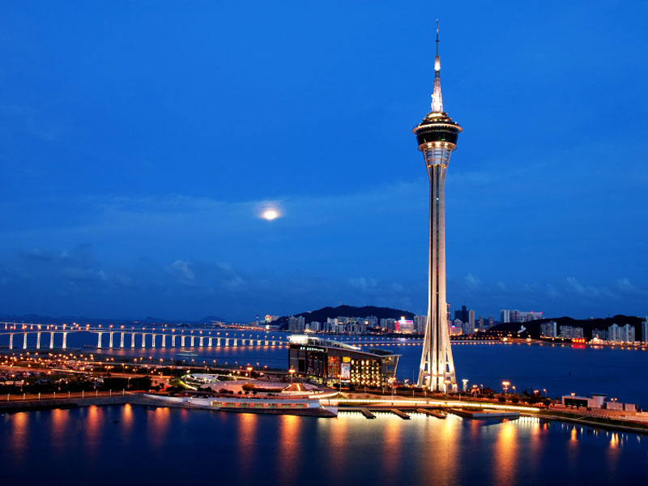
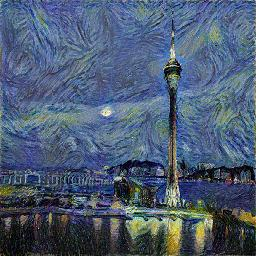

# Implementation Neural style transfer #

This is an implementation of the "[A Neural Algorithm of Artistic Style](http://arxiv.org/abs/1508.06576)". This uses the selected filtered responses of a pre-trained model (VGG-16) to capture low level to high level features and transfer them to the content image.

Results:

Using the StarryNight:

# How to run

You will need to install dependencies:

- TensorFlow
- Scipy
- Numpy

References:
- [A Neural Algorithm of Artistic Style](http://arxiv.org/abs/1508.06576)
- [https://github.com/jcjohnson/neural-style](https://github.com/jcjohnson/neural-style)
- [https://github.com/ckmarkoh/neuralart_tensorflow](https://github.com/ckmarkoh/neuralart_tensorflow)
